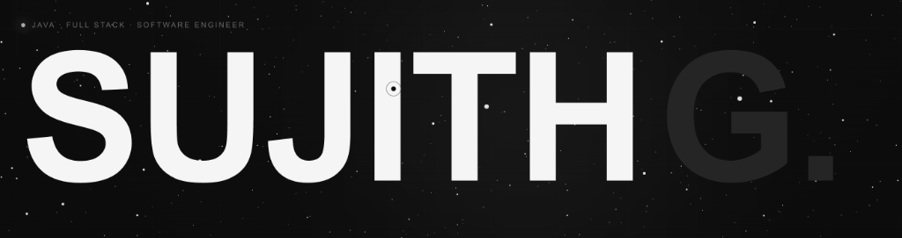
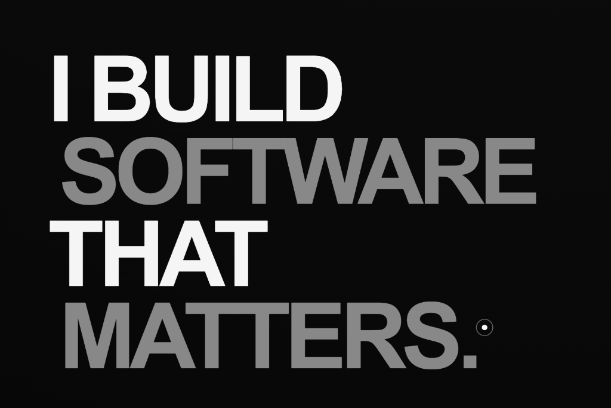
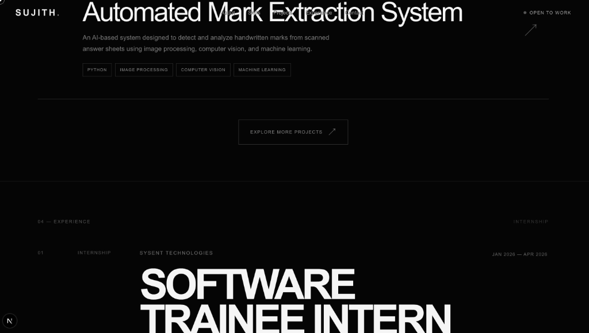
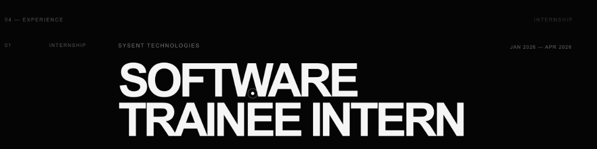
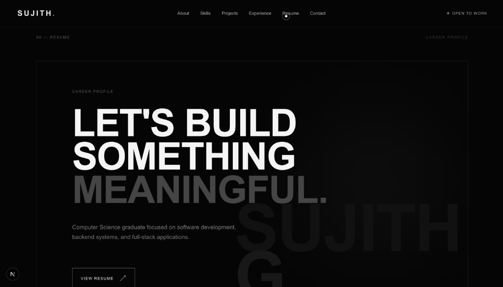
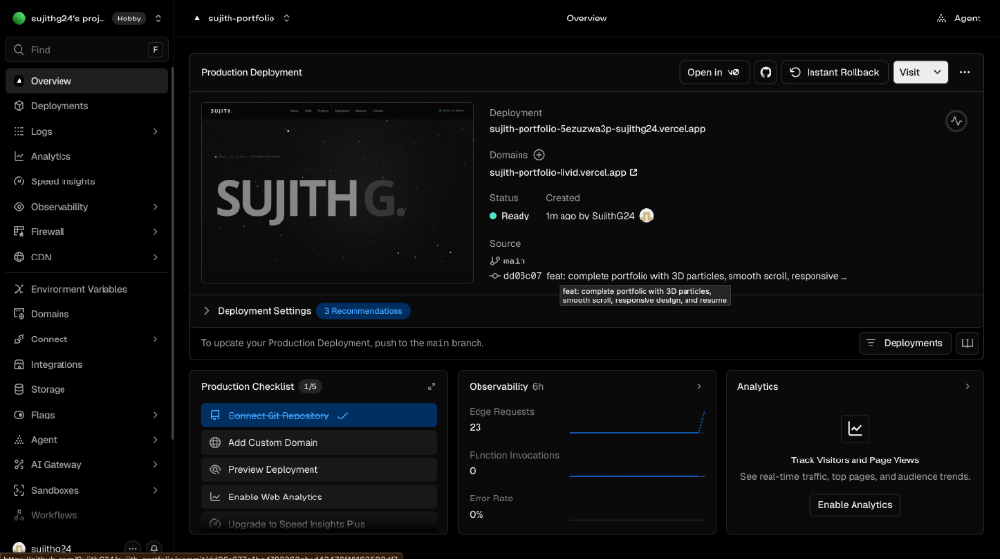

# Sujith G. — Software Engineering Portfolio

<div align="center">

[](https://sujith-portfolio-livid.vercel.app)
[](https://nextjs.org/)
[](https://www.typescriptlang.org/)
[](https://threejs.org/)
[](https://tailwindcss.com/)

**A premium, cinematic, interactive software-engineering portfolio engineered to demonstrate real-world full-stack & backend capability.**

[Explore Live Portfolio ↗](https://sujith-portfolio-livid.vercel.app) · [View Resume PDF ↗](https://sujith-portfolio-livid.vercel.app/Sujith-G-Resume.pdf) · [Connect on LinkedIn ↗](https://www.linkedin.com/in/sujith-g-1618a3290)

</div>

---

## 📸 Visual Showcase & Proof

### 01 — Hero Experience & 3D Interactive Particle Field
> 1,800 responsive 3D particles with deceleration sweep, cursor-driven parallax, and animated typography.



---

### 02 — Editorial About Section
> High-contrast, typography-first identity communicating engineering philosophy and key academic metrics.



---

### 03 — Featured Projects & Case Studies
> Showcase of full-stack system architecture (Spring Boot, React, MySQL) and AI/Computer Vision systems.



---

### 04 — Professional Experience / Internship
> Sysent Technologies internship detailing AI handwritten mark detection, extraction, and ML classification pipelines.



---

### 05 — Interactive Resume Profile
> Integrated PDF delivery serving verified credentials and technical qualifications with single-click access.



---

### 06 — Direct Contact & Social Integration
> Viewport-fitted communication layer with quick-access links to verified profiles.


---

### 07 — Production Vercel Deployment Proof
> Globally distributed CDN deployment with automated continuous integration (CI/CD) and SSL/HTTPS.



---

## 🛠️ Engineering Stack

| Layer | Technologies |
| :--- | :--- |
| **Core Framework** | Next.js 16 (App Router, Turbopack), React 19, TypeScript |
| **3D & Graphics** | Three.js, React Three Fiber (R3F), Drei |
| **Motion & Animation** | GSAP 3 (ScrollTrigger, Timelines), Lenis Smooth Scroll |
| **Styling & Design** | Tailwind CSS v4, Custom CSS Architecture, Glassmorphism |
| **Deployment** | Vercel Global Edge Network, Git / GitHub CI/CD |

---

## ✨ Key Features & Architecture

* **🌌 3D Interactive Universe**: Canvas particle field featuring dynamic physics, smooth velocity lerp, and real-time cursor attraction.
* **📜 Unified Scroll Synchronization**: Lenis virtual scrolling seamlessly synchronized with GSAP ScrollTrigger for 60fps cinematic section transitions.
* **🎨 Editorial Design System**: Custom dark-mode typography with precise kerning, frosted-glass header with active status indicators, and micro-interactions.
* **⚡ Production Performance**: Fully pre-rendered static assets, GPU-accelerated transforms, zero layout shifts, and responsive breakpoints from mobile to 4K displays.
* **📄 Integrated Resume Delivery**: Direct zero-latency serving of verified PDF resume credentials.

---

## 🚀 Local Development Setup

To run this portfolio locally on your machine:

```bash
# 1. Clone the repository
git clone https://github.com/SujithG24/sujith-portfolio.git

# 2. Navigate to the project directory
cd sujith-portfolio

# 3. Install dependencies
npm install

# 4. Start the development server
npm run dev
```

Open [http://localhost:3000](http://localhost:3000) in your browser to view the application.

---

## 👨‍💻 Developer Profile

**Sujith G.** — *Java Full-Stack Developer & Software Engineer*  
* **Email**: [sujith2482004@gmail.com](mailto:sujith2482004@gmail.com)  
* **LinkedIn**: [linkedin.com/in/sujith-g-1618a3290](https://www.linkedin.com/in/sujith-g-1618a3290)  
* **GitHub**: [github.com/SujithG24](https://github.com/SujithG24)  
* **Portfolio**: [sujith-portfolio-livid.vercel.app](https://sujith-portfolio-livid.vercel.app)

---

<div align="center">
Designed & Built with ❤️ by Sujith G. © 2026
</div>
